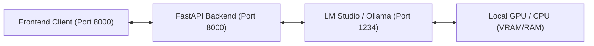

# 🌸 Ai-Chan (愛ちゃん) | Voice & AI Anime Companion

[](https://www.python.org/)
[](https://fastapi.tiangolo.com/)
[](https://github.com/astral-sh/uv)
[](https://github.com/rany2/edge-tts)
[](LICENSE)

**Ai-Chan** is a full-stack, offline-first AI Anime Companion designed to run entirely locally on your machine. Featuring a stunning glassmorphism dashboard, real-time high-quality speech synthesis, browser-based voice input, and deep integrations with local large language models (LLMs) via LM Studio or Ollama, Ai-Chan brings customizable anime characters to life with native performance and absolute privacy.

---

## ✨ Key Features

*   **🎙️ Real-Time High-Quality TTS**: Integrated with Microsoft Edge's translation/neural speech synthesis engine (`edge-tts`) for incredibly expressive voices with customizable pitch and speed.
*   **🎭 3 Distinct Companion Personalities**:
    *   **Ai-Chan (愛ちゃん)**: Energetic, highly cheerful, bubbly, and gaming-obsessed. Talks to you as her beloved *Senpai*.
    *   **Kaguya (かぐや)**: Elegant, sophisticated, proud, and classic *Tsundere*. Speaks formally but secretly cares deeply.
    *   **Mochi (もち)**: A small, childish chibi mascot who is constantly excited, refers to itself in the third person, and is obsessed with eating sweets.
*   **🌐 Bilingual Conversational Core**: Fully supports both **English (英語)** and **Japanese (日本語)** with specific character voice mappings matching the selected language.
*   **🧠 Offline LLM Integration with Fallback**:
    *   Connects out-of-the-box to local OpenAI-compliant APIs (LM Studio/Ollama) running at `http://127.0.0.1:1234`.
    *   *Smart Fallback*: If your local server is offline or your GPU is sleeping, characters enter a friendly simulated mode to guide you on how to turn it on, ensuring zero UI breakage!
*   **🗣️ Speech-to-Text Input**: Dictate your thoughts seamlessly using the native Web Speech API built directly into modern web browsers.
*   **💫 Dynamic Responsive UI & Micro-Animations**:
    *   Sleek glassmorphism effects, harmonized color schemes, and responsive panel structures using premium typography (*Outfit* & *Noto Sans JP*).
    *   **Interactive Visual States**: The companion's avatar changes behavior and is wrapped in ambient glowing rings depending on status: **Idle (Calm pulsing)**, **Thinking (Swirling blue)**, and **Talking (Active neon wave)**.
    *   **Speech Waves**: A live-rendered waveform that bounces and dances dynamically in sync with character audio playback.
*   **⚙️ Intelligent Synthesis Filter**: The backend parses conversational responses to strip narrative stage-actions (like `*giggles*` or `(sighs softly)`) so the synthesized voice sounds completely natural, while preserving the full narrative text inside the chat bubbles.
*   **🧹 Automatic Housekeeping**: Built-in automatic audio cache cleanup that removes older TTS files to optimize your local disk footprint (keeps files under 10 minutes or up to 50 active files).

---

## 📂 Project Architecture

The repository is divided into a lightweight FastAPI Python backend and a fast, responsive vanilla frontend:

```text
ai-chan/
├── main.py                 # FastAPI Application (API Routing, TTS Engine, Cache Management)
├── pyproject.toml          # Project metadata & Python dependencies (FastAPI, Edge-TTS, httpx)
├── uv.lock                 # Strict dependency locking
├── frontend/               # Single-page dynamic web client
│   ├── index.html          # Semantic HTML5 Layout & outfit typography links
│   ├── style.css           # Vanilla CSS3 styling, custom animation keyframes, Glassmorphism design
│   ├── app.js              # Application state machine, audio playback, speech-to-text logic
│   ├── assets/             # Vector / raster illustrations of companions
│   └── temp_audio/         # [Auto-managed] Directory where temporary mp3 voices are compiled
```

---

## 🚀 Setup & Installation

Ai-Chan uses **`uv`**, the blazing-fast Python package manager and resolver. If you do not have `uv` installed, you can also use standard `pip`.

### 1. Clone & Navigate
Clone this repository to your local workspace and open it:
```bash
git clone <repository-url>
cd ai-chan
```

### 2. Install Dependencies
Choose one of the following options to set up your environment:

#### Option A: Using `uv` (Recommended)
`uv` will automatically read `pyproject.toml` and lock files to configure your virtual environment:
```bash
# Create and activate a virtual environment
uv venv
.venv\Scripts\activate      # On Windows (PowerShell/CMD)
source .venv/bin/activate   # On Linux/macOS

# Synchronize dependencies
uv sync
```

#### Option B: Using standard `pip`
```bash
pip install -e .
```

---

## 🎮 How to Run

### Step 1: Start the Backend Server
Launch the FastAPI ASGI server by running `main.py`. This automatically loads Uvicorn:
```bash
# Using uv
uv run main.py

# Or using standard python
python main.py
```
You should see confirmation logging in your terminal:
```text
INFO - Starting Ai-Chan server on http://127.0.0.1:8000
INFO:     Started server process [12345]
INFO:     Waiting for application startup.
INFO:     Application startup complete.
INFO:     Uvicorn running on http://127.0.0.1:8000 (Press CTRL+C to quit)
```

### Step 2: Access the Application
Open your favorite modern web browser and navigate to:
👉 **[http://127.0.0.1:8000](http://127.0.0.1:8000)**

---

## 🧠 Setting Up Local Offline AI (Optional but Highly Recommended)

To power Ai-Chan's brain locally rather than using Fallback simulations, set up **LM Studio** or **Ollama** as your offline Inference Server:



### Setup with LM Studio:
1.  Download and install [LM Studio](https://lmstudio.ai/).
2.  Search and download a local LLM from the HuggingFace repository tab (highly recommended models: `google/gemma-2-2b-it`, `qwen2.5-1.5b-instruct`, `llama-3-8b-instruct`).
3.  Navigate to the **Local Server** (double-headed arrow icon) tab on the left.
4.  Select your downloaded model from the dropdown at the top.
5.  Set the port configuration to `1234` (Default).
6.  Click **Start Server**.
7.  Return to the Ai-Chan browser page and click the **Refresh Connection** icon (`🔃`) next to the "Offline AI Connection" card in the sidebar. The indicator dot will turn from <span style="color:#ff3366">● Red (Offline)</span> to <span style="color:#00ff99">● Green (Connected)</span> and list the active model loaded inside LM Studio!

---

## 🎙️ Local Offline Voice Synthesis (Style-Bert-VITS2)

To unlock state-of-the-art, high-quality, completely offline Japanese and English voice generation, Ai-Chan supports deep integration with **Style-Bert-VITS2**. By running Style-Bert-VITS2 locally, voice files are rendered with rich emotions and inflections right on your CPU or GPU.

The local voice server is located at `D:\Projects\sbv2\Style-Bert-VITS2` and runs on `http://127.0.0.1:7860`.

### 🛠️ Environment & Dependency Configuration (Critical)

Due to recent package updates, standard installs of Style-Bert-VITS2 may crash in modern Python setups. Follow these steps to secure environment stability:

1. **`setuptools` Compatibility Lock (`setuptools < 82`)**:
   * **Problem**: `setuptools >= 82.0.0` deprecates and removes `pkg_resources`, which is required by `pyopenjtalk` (the Japanese NLP tokenizer). Without a downgrade, you will face `ModuleNotFoundError: No module named 'pkg_resources'`.
   * **Fix**: Force downgrade `setuptools` to version `81.0.0`.
2. **`transformers` PyTorch Security Bypass (`transformers < 4.48`)**:
   * **Problem**: `transformers >= 4.48.0` implements a strict PyTorch security guard (CVE-2025-32434) that completely blocks model loading via `torch.load` on older PyTorch runtimes (such as PyTorch 2.3.1).
   * **Fix**: Force lock `transformers` to `4.47.1` and `tokenizers` to `0.21.4`.

---

### 🚀 Step-by-Step Setup & Launch

#### Step 1: Open Terminal & Activate the SBV2 Environment
Open a terminal inside your Style-Bert-VITS2 directory (`D:\Projects\sbv2\Style-Bert-VITS2`):
```bash
cd D:\Projects\sbv2\Style-Bert-VITS2
venv\Scripts\activate      # Activate the virtual environment
```

#### Step 2: Install Stability Locks
Run these specific commands to pin the stable dependencies:
```bash
# Pin setuptools to maintain pkg_resources support
pip install "setuptools==81.0.0"

# Pin transformers and tokenizers for PyTorch compatibility
pip install "transformers==4.47.1" "tokenizers==0.21.4"
```

#### Step 3: Add Voice Model Assets
Place your downloaded Style-Bert-VITS2 voice models inside the `model_assets` directory. For example:
* `D:\Projects\sbv2\Style-Bert-VITS2\model_assets\amitaro\amitaro.safetensors`
* `D:\Projects\sbv2\Style-Bert-VITS2\model_assets\jvnv-F1-jp\jvnv-F1-jp.safetensors`

*Note: The Ai-Chan backend automatically scans these paths to display clean names in the frontend companion UI (e.g. `amitaro`, `jvnv-F1-jp`).*

#### Step 4: Run the FastAPI Voice Server
Launch the local speech synthesis API:
```bash
python server_fastapi.py
```
You should see:
```text
INFO:     Started server process [xxxxx]
INFO:     Uvicorn running on http://127.0.0.1:7860 (Press CTRL+C to quit)
```

---

### 🎛️ Connecting Ai-Chan to Style-Bert-VITS2

Once the voice server is running:

1. **Launch/Refresh Ai-Chan**: Load `http://127.0.0.1:8000` in your browser.
2. **Review Connection Card**: In the left sidebar, the **Local SBV2 Connection** indicator will turn <span style="color:#00ff99">● Green (Online)</span>.
3. **Switch Voice Engine**: In the Companion Settings block under **Voice Synthesis Engine**, toggle the slider from **Edge-TTS (Cloud)** to **Style-Bert-VITS2 (Local)**.
4. **Tune Speech Style**:
   * Select your preferred **Voice Model** and **Speaker**.
   * Pick an emotional **Speech Style** (e.g., *Happy*, *Sad*, *Angry*, or *Neutral*).
   * Customize speech attributes using advanced audio sliders:
     * **SDP Ratio**: Controls phoneme style/speed ratio.
     * **Noise (Emotion scale)**: Adjusts vocal variance and emotion intensity.
     * **Noise W (Pronunciation variance)**: Fine-tunes pronounciation stability.

---

## 🛠️ Tech Stack Details

*   **FastAPI / Uvicorn**: Chosen for asynchronous HTTP connection speeds, standard middleware handling (CORS support), and robust static file streaming.
*   **edge-tts**: Interacts with the Microsoft Edge Voice API using asynchronous web sockets, fetching near-human vocal inflections without needing expensive local TTS models that eat up precious GPU memory.
*   **Vanilla CSS3 / Custom Variables**: Employs an HSL-tailored dark theme layout featuring glassmorphism cards (`backdrop-filter: blur`), glowing linear gradients, neon accents, and keyframe animations (`float`, `pulse`, `glow-swirl`, `wave-dance`) to achieve state-of-the-art visual premium standards.
*   **Pydantic Models**: Strictly enforces API JSON schema contracts between client actions and backend operations.

---

## 📜 License

This project is open-source and licensed under the [MIT License](LICENSE). Feel free to customize her templates, build brand-new companions, or adapt the architecture for custom voice automation!

---

*Made with 💖 by Senpai's developers.*
